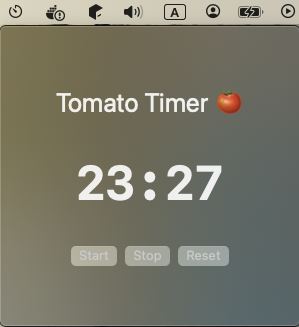

## Pomodoro

Heavily inspired by / aspiring to be: [the pomodoro timer extension from
gnome](https://extensions.gnome.org/extension/53/pomodoro/) this is a really
simple app although it's still missing the options feature aside from that it's
just a timer, so nothing too complicated and another excuse to use SwiftUI, I'm
sure something like this already exists out there, but it's probably bloated to
hell hence why I wrote this version.

## TODO

- [ ] fix faded buttons
- [ ] options panel to change the duration of the timer and the sound and such

## Images

